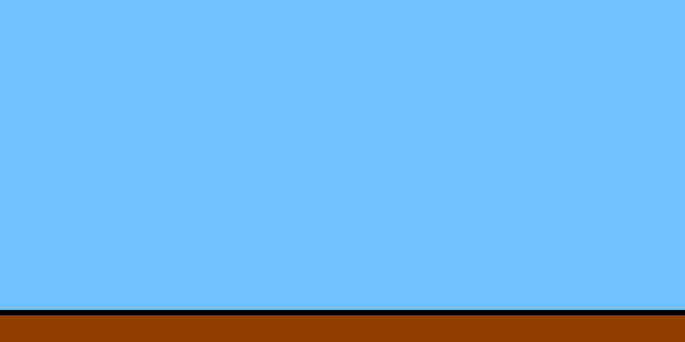
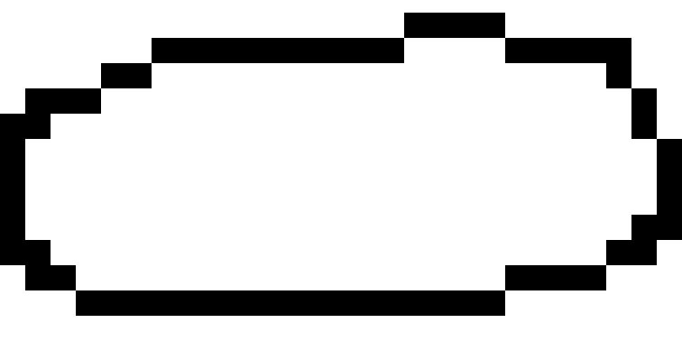
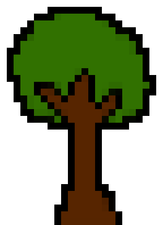
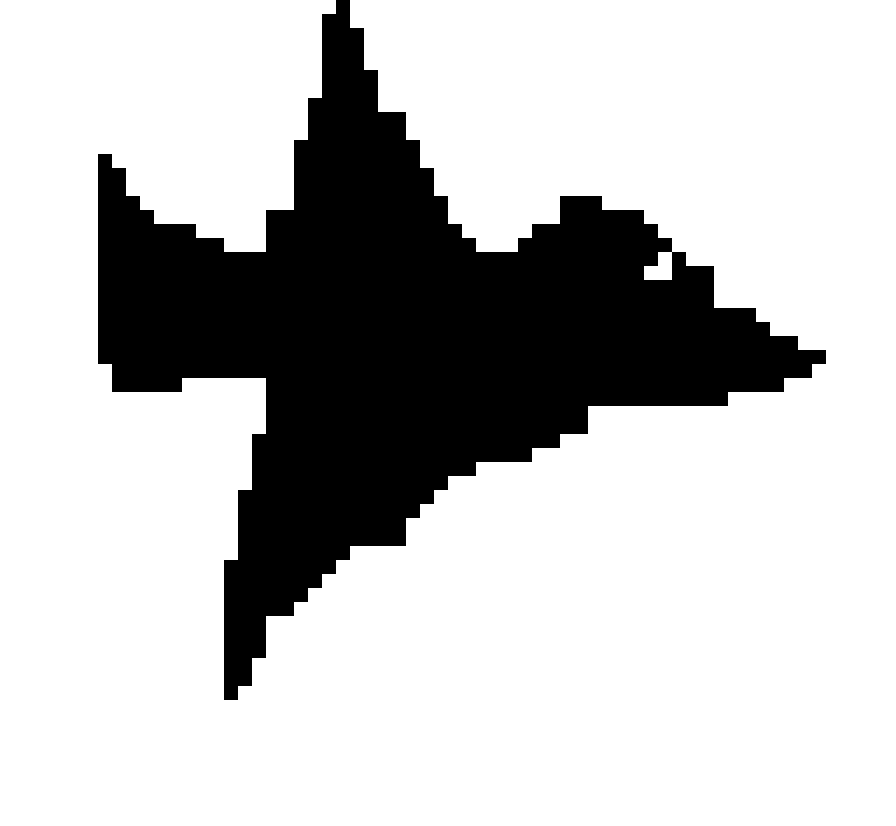
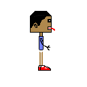
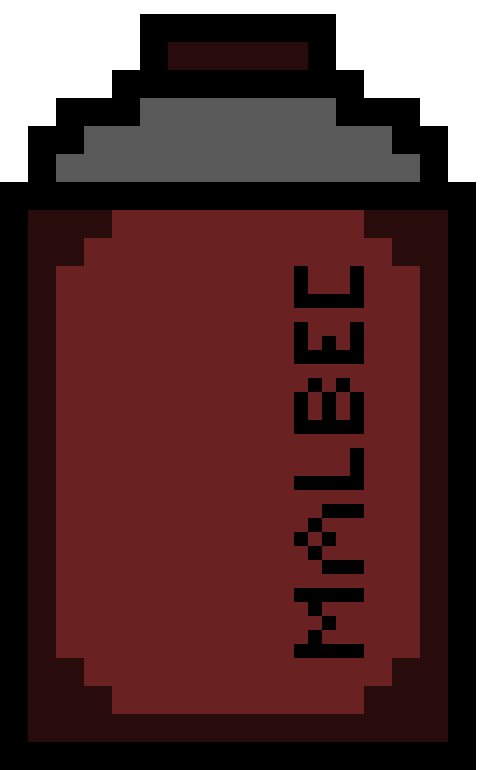

<!DOCTYPE html>
<html lang="pt-br">
<head>
    <meta charset="UTF-8">
    <meta http-equiv="X-UA-Compatible" content="IE=edge">
    <meta name="viewport" content="width=device-width, initial-scale=1.0">
    <title>RudiGame</title>
    <link rel="stylesheet" href="style.css">
</head>
<body onload="onload()">
    <header>
        <h1>Bem vindo ao jogo do rudi!</h1>
        
Pontuação: 0

    </header>
    <main>
        
        
        
        
        
        
        
    </main>
    
</body>
</html>
